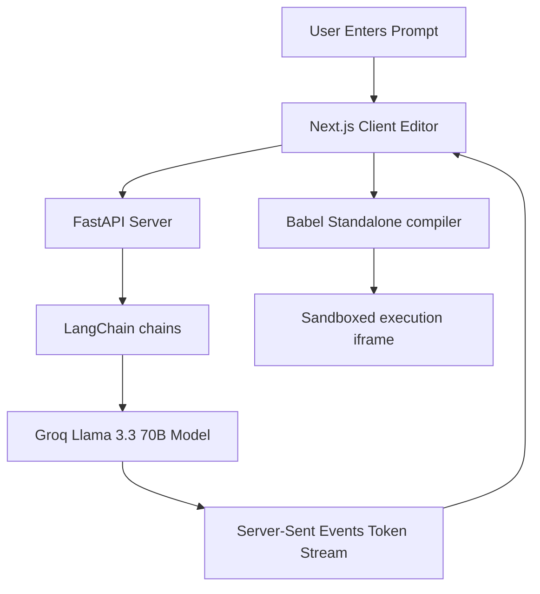

# ⚡ RAPIDSKETCH — AI-Powered Frontend Prototyping

RapidSketch is a web-based, real-time development environment that transforms single natural language prompts into fully functional, live-previewed React/HTML/CSS applications. By combining LLM code streaming with in-browser compilation, it allows developers to build, test, and iterate on interactive prototypes in seconds.

The editor is styled with a premium, sleek dark-themed console interface, complete with a multi-file explorer, project history persistence, and custom modal dialog overlay workflows.

---

## 🏗️ Architecture & Core Components



### 1. LangChain AI Stream Engine (FastAPI Backend)
* **Structured Generation**: Streams Llama 3.3 tokens in real-time. Code generation is handled via LangChain pipelines (`generate.py` and `refine.py`).
* **Iterative Refinement**: The AI retains chat context, letting users refine components using conversational text requests.
* **Structured Parsing**: Backend parses and packages structured files (e.g. `App.jsx`, `styles.css`) for the client.

### 2. Client-Side Sandboxed Compiler (Babel Standalone)
* **Local ESM Generation**: Eliminates network dependencies by wrapping loaded UMD libraries (`React`, `ReactDOM`, and `LucideReact`) into dynamic, local ES module blobs.
* **importmap Resolution**: Maps `"react"`, `"react-dom"`, `"react-dom/client"`, and `"lucide-react"` imports directly to the local dynamic blobs inside the sandboxed preview iframe.
* **Runtime Transpilation**: Babel standalone transpiles React JSX and TypeScript (`.tsx`/`.ts`) files on-the-fly in the browser.

### 3. Secure Asymmetric Authentication (Supabase JWT Verification)
* **ES256 Verification**: Session access tokens are cryptographically verified by the backend using public JWKS cert keys for asymmetric `ES256` Elliptic Curve signatures.
* **Persistent History**: Users sign in to save workspace progress, edit project titles, and recall previous generation history.

---

## 🚀 Setup & Execution Guide

### 1. Prerequisites
* **Node.js** (v18+) and npm installed
* **Python** (v3.10+) installed
* **Groq Cloud API Key**

---

### 2. Backend Setup & Run
Open a terminal in the `/backend` directory:

1. **Configure Environment Variables**:
   Create a `.env` file inside `/backend` (using `.env.example` as a template):
   ```env
   GROQ_API_KEY="your-groq-api-key"
   SUPABASE_JWT_SECRET="your-supabase-jwt-secret"
   ```

2. **Activate the Virtual Environment**:
   * **Windows (PowerShell)**:
     ```powershell
     venv\Scripts\Activate.ps1
     ```
   * **macOS/Linux**:
     ```bash
     source venv/bin/activate
     ```

3. **Install Dependencies**:
   ```bash
   pip install -r requirements.txt
   ```

4. **Start the API Server**:
   ```bash
   uvicorn main:app --reload --port 3001
   ```
   *Note: The backend runs by default on **http://localhost:3001**.*

---

### 3. Frontend Setup & Run
Open a terminal in the `/frontend` directory:

1. **Configure Environment Variables**:
   Create a `.env` file inside `/frontend` if you wish to override the default local backend URL:
   ```env
   NEXT_PUBLIC_BACKEND_URL="http://localhost:3001"
   NEXT_PUBLIC_SUPABASE_URL="your-supabase-url"
   NEXT_PUBLIC_SUPABASE_ANON_KEY="your-supabase-anon-key"
   ```

2. **Install Dependencies**:
   ```bash
   npm install
   ```

3. **Run Dev Server**:
   ```bash
   npm run dev
   ```

4. Open [http://localhost:3000](http://localhost:3000) in your browser to start prototyping.

---
